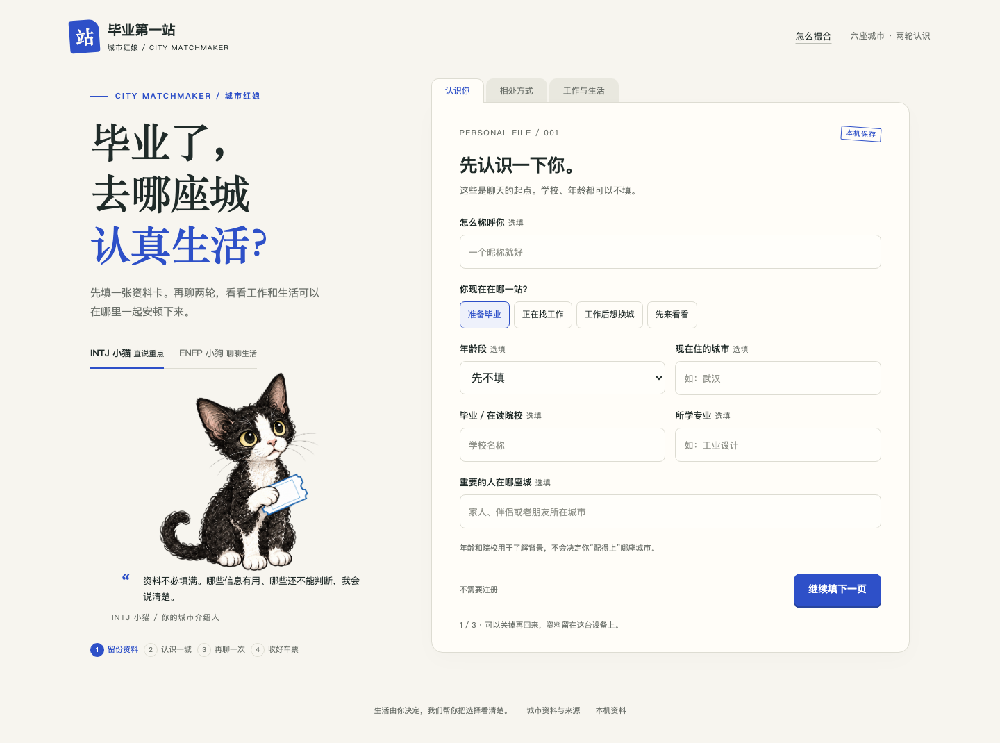

# 城市红娘：晨间交付（历史记录）

后续更新：源码已进入 GitHub 发布流程；当前公开状态以 [publication.md](docs/publication.md) 为准。以下记录保留晨间验收时点，不代表后续发布进展。

**2026-10-03 北京时间 08:40 更新。晨间验收于 08:30 触发，现已完成本轮本地体验交付。**

## 可以直接体验

[打开毕业第一站](http://127.0.0.1:4318)

这是本机 Web 体验版。当前服务保持运行；不是公网链接，不代表 App Hub 已发布。重新启动可在本目录运行 `node serve.mjs`。

## 已实现并验收

- 三页个人资料先行：认识你、相处方式、工作与生活；信息可选填、页签可切换、本机保存。
- 确认过的 INTJ 黑白开脸德文猫与 ENFP 线条小狗；切换角色保留答案及排序。
- 六城特点库、明确个人偏好、可解释的匹配规则。
- 第一个关键问题、一座城市介绍、具体反馈、第二轮追问与重新比较。
- 结果解释推荐理由、代价与未知；明确拒绝会排除，空资料或同分不会包装成唯一首选。
- 城市车票 PNG 下载、推荐摘要复制、来源背面、资料恢复与清除。
- 分享不含昵称、年龄、院校、预算或欣赏的人的信息。数据仅在本机流转。

一次真实合成资料回归：科技＋户外与演出＋职业优先 → 首轮上海 → 明确拒绝上海并强调户外 → 第二轮杭州，候选列表不再含上海。该示例验证规则和反馈链路，不验证现实推荐准确性。

## 验证证据

| 范围 | 实际结果 |
| --- | --- |
| 匹配与数据 | 24 项测试全部通过，0 失败，0 跳过 |
| 浏览器完整流程 | `qa/browser-smoke.mjs` 通过；结果存于 `qa/browser-smoke-result.json` |
| 手机界面 | Chromium 320/375/390px 模拟尺寸通过，无横向溢出；尚非实体设备验收 |
| 反馈、恢复与隐私 | 两轮操作、明确排除、修改使旧结果失效、刷新恢复、资料清除、PNG 下载和复制实测通过 |
| OctoScript | 真实 card-host 两轮、存档、重启恢复、清除和滚动通过；四张截图在 bundle/screenshots |
| 本地 App Hub gate | `hub check --allow-unsigned` PASSED，仅 unsigned warning；不等于发布审核通过 |

来源记录有16条；城市数值是公开资料基础上的人工分档，不是统计测量。资料年份和空缺见 [城市来源说明](docs/data-sources.md)。

## 两个版本的边界

Web 版视觉、交互和分享完整，按本地规则运行，未调用大模型。

原生 OctoScript 版已验证核心撮合流程并具有系统 Agent 入口。实际 card-host 返回 `no service answers "octos" on this device`，页面正确显示不可用并保留本地结果。本应用尚未在完整 Shell 接通 MiniMax/Kimi；原生版也没有 Web 的 PNG 分享功能。

**正式参赛未完成：** 本应用完整 Shell 安装与真实模型、正式签名、公开支持/隐私 URL（当前 listing 为占位）、GitHub 仓库/Tag、App Hub Issue 与人工审核。当前不应宣称正式上架。

## 产品判断与接下来最关键的验证

已经做到了“先资料、再关键问题、听反馈、解释变化”。还没证明真实毕业生会满意或愿意传播。

尤其需要检验：年龄、院校、MBTI 与欣赏的人格这些背景字段不参与本版排名，它们是否值得用户付出填写成本。当前界面已如实说明用途，不承诺人格预测。下一轮优先观察5位真实目标用户是否看懂依据、能说出不喜欢的点、二轮是否比首轮有帮助，再决定补哪些数据和追问。

- [产品逻辑与验证方案](docs/product-design.md)
- [完整匹配规则](docs/matching-model.md)
- [Web 验收记录](docs/web-qa.md)
- [原生包、命令及发布阻断项](docs/octosense.md)

本次一次性晨间跟进已完成，不再安排重复通知。
