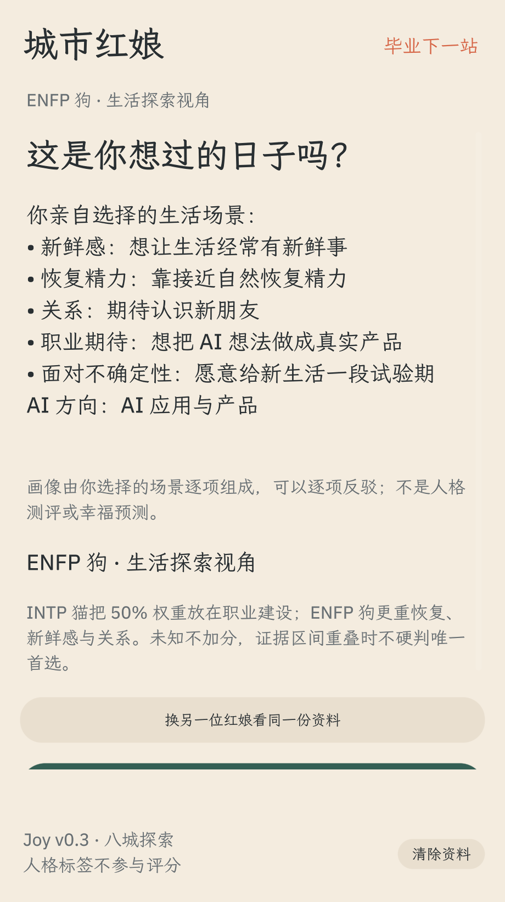

# 毕业第一站 · Joy City

**给想做 AI 产品的你，找一座愿意留下的城市。**


**GOSIM Agentic App 2026｜MOST暴躁队｜Leinstein** · [初赛仓库登记](https://github.com/gosimfoundation/hackathon-agenticapp26/issues/13#issuecomment-5964776262)

缩小职业范围之后，决定下一站的，往往还有一整周怎么过。你需要多少新鲜感、靠什么恢复精力、想要怎样的关系、期待怎样做 AI、能接受多少变化？Joy City 把这些选择整理成一份可修改的生活画像，再介绍城市的吸引力、代价和未知。

本项目的参赛作品是 **OctoSense 原生脚本应用**：`bundle/main.splash`，采用官方 [script-app 流程](https://github.com/OctoSense-org/OctoScript-App-Design-Flow/blob/main/flows/script-app/FLOW.md)。无需用浏览器承载界面，也无需编写或编译本应用的 Rust 代码。

当前版本 **v0.3.0**，聚焦 AI 应用、产品、设计与落地。它帮助你找到值得了解和试住的城市，不预测幸福概率，也不保证就业结果。公开仓库与版本标签状态见 [publication.md](docs/publication.md)。

## 怎么玩

1. **选日常。** 5 个生活场景，天气和现实条件可选填。无需先聊天，也不用交出一长串个人信息。
2. **核对画像。** 每句话都来自你的选择，点开就能修改。
3. **认识一座城。** 看推荐依据、吸引力与代价。
4. **说心动或介意的地方。** 再确认一个关键选择，重新比较；明确拒绝的城市会保留排除。
5. **换个视角。** ENFP 线条小狗先看生活，INTP 黑白德文猫先看职业期待。事实相同，侧重不同，排序可以不同。
6. **准备去看看。** 看个人试城计划，收好不含身份资料的分享摘要。



## 启动参赛应用

准备好官方 `card-host` 和 `hub` 后，在仓库根目录运行：

```sh
OCTO_CARD_HOST=/path/to/card-host \
OCTO_HUB=/path/to/hub \
./tools/run-native.sh
```

脚本先校验 `bundle/`，再打开真正的原生窗口；本地撮合无需 API Key 或 Node.js。平台工具安装见 [官方 QUICKSTART](https://github.com/OctoSense-org/OctoScript-App-Design-Flow/blob/main/docs/QUICKSTART.md)，已测工具版本和平台见 [runtime-lock.md](docs/runtime-lock.md)。

`card-host` 是官方参考宿主，适合开发、试玩和原生验收，不提供模型服务。完整 OctoSense Shell 中安装与应用 Agent 的真实模型调用另行验证，不能用前者代替。应用模型权限由宿主处理，密钥不进入本项目。

原生说明：[运行与验证](docs/octosense.md) · [需求与权限](BRIEF.md) · [原生截图](bundle/screenshots) · [初赛材料](docs/submission-checklist.md)。

## 依据从哪里来

覆盖**北京、上海、杭州、深圳、广州、成都、武汉、南京**，记录 32 条来源。

- 五维画像与气候来自本人明确选择；MBTI、星座、学校和年龄不决定排序。
- 136 条城市与偏好信号中，47 条为公开资料上的人工分档，89 条未知。分档尚未经真实用户结果验证。
- 活动、公共空间、AI 实践入口可以提供探索线索；安静程度、稳定关系、工作强度和个人能承受的变化不能凭城市印象打分。
- 无法比较的偏好仍用于画像和试城计划，**不会冒充已影响排序**。未知项不补成平均值；候选区间重叠时明确保留不确定性。
- 房租、合租方式和通勤上限只形成待核验条件；需具体工作地、房源及路线才能判断。
- 反馈不是“点喜欢就偷偷加分”。应用复核对应维度，再按你确认的答案重排；没有新依据时也会如实保留原推荐。

详细规则见 [匹配模型](docs/matching-model.md)、[城市来源](docs/data-sources.md)、[产品设计](docs/product-design.md)。

## 当前能力与边界

原生包实现五维场景、可编辑画像、推荐与反馈重排、猫狗双视角、来源、试城计划、本地存档与旧版迁移。其 `main.splash` 是官方支持的 Makepad Script / Splash 入口；`page.card` 是另一条 L0 卡片路线，不是本项目的入口。

应用 Agent 使用宿主 `octos.*` 服务提出受控修改，再由用户确认执行。当前 CM1 有效操作主要是新增气候避开项与明确拒绝城市；五维答案由本人按钮确认。提案不能改写城市数据、恢复已拒绝城市或撤销天气底线。真实模型完整成功链路仍待验收；临时响应注入测试只证明执行保护机制。

本轮初赛以公开源码和可运行作品为据，[官方说明](https://github.com/gosimfoundation/hackathon-agenticapp26/blob/main/docs/app-hub-submission.md)明确无需等待 Hub 上架。**本项目未公开上架 App Hub**；本地检查通过不等于主办方审核通过。

## 验证与演示

原生界面、存档与排序对照：

```sh
OCTO_CARD_HOST=/path/to/card-host OCTO_HUB=/path/to/hub python3 tools/native_joy_smoke.py
OCTO_CARD_HOST=/path/to/card-host OCTO_HUB=/path/to/hub python3 tools/native_agent_smoke.py
```

原生真实操作脚本为 `tools/native_joy_smoke.py`，Agent 执行保护检查为 `tools/native_agent_smoke.py`。测试检查真实窗口、存档与迁移、失败状态、明确排除、规则一致性；公开截图均用合成资料。已经验证的是 Apple silicon macOS，未据此声称手机或其他平台已验证。

共享规则的补充测试为 `node --test tests/*.test.mjs`；原生与 JavaScript 对照测试需安装 Node.js 22+，应用本身的运行不需要。

[原生 Joy 验收报告](qa/native-joy-check.json) · [Agent 协议验收报告](qa/native-agent-check.json) · [演示材料及范围](docs/demo.md)

这些验证证明流程能运行，不证明推荐准确率、传播效果或真实用户满意度。下一步需要目标用户实际体验，检验画像是否贴切、理由是否有用，以及第二轮是否更符合偏好。

## 开发与资料

```text
bundle/                 参赛应用：main.splash、权限、素材、原生截图
tools/                  原生模板、生成、启动与验收
core/                   共享匹配、画像、追问与试城计划
data/joy-config.json    共用场景、权重及行动文案
data/cities.json        城市信号、来源与未知项
web/                    辅助交互体验与 PNG 分享探索
tests/  qa/             规则测试、操作验证与录屏
docs/                   产品、来源、发布边界
```

原生通过 `python3 tools/build_bundle.py` 从模板和共享数据生成；不要只修改 `bundle/main.splash`。平台工具不随仓库打包。

原生资料存在本机应用隔离目录；点击应用 Agent 后的发送范围见 [隐私说明](docs/privacy.md)。公开验收全部使用合成资料。

## 辅助 Web 体验

`node serve.mjs` 可在同一台电脑的 http://127.0.0.1:4318 打开交互研究版，需 Node.js 22+。它按本地规则运行、未接模型，不是参赛包，也不是公开在线 Demo。PNG 分享车票目前只在 Web 实现。资料存在浏览器本机，默认分享不含身份、预算或自由文本。见 [Web 验收](docs/web-qa.md)。

[Apache-2.0](LICENSE) · [素材声明](NOTICE) · [问题与建议](https://github.com/SuperLeilei2026/city-matchmaker/issues)
