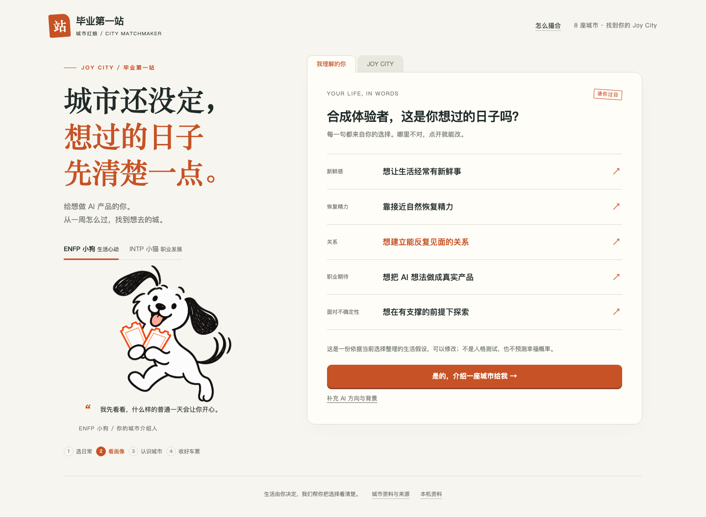

# 毕业第一站 · Joy City

**给想做 AI 产品的你，找一座愿意留下的城市。**


**GOSIM Agentic App 2026｜MOST暴躁队｜Leinstein** · [初赛仓库登记](https://github.com/gosimfoundation/hackathon-agenticapp26/issues/13#issuecomment-5964776262)

缩小职业范围之后，决定下一站的，往往还有一整周怎么过。你需要多少新鲜感、靠什么恢复精力、想要怎样的关系、期待怎样做 AI、能接受多少变化？Joy City 把这些选择整理成一份可修改的生活画像，再介绍城市的吸引力、代价和未知。

当前版本 **v0.3.0**，聚焦 AI 应用、产品、设计与落地。它帮助你找到值得了解和试住的城市，不预测幸福概率，也不保证就业结果。

## 怎么玩

1. **选日常。** 5 个生活场景，天气和现实条件可选填。无需先聊天，也不用交出一长串个人信息。
2. **核对画像。** 每句话都来自你的选择，点开就能修改。
3. **认识一座城。** 看推荐依据、吸引力与代价。
4. **说心动或介意的地方。** 再确认一个关键选择，重新比较；明确拒绝的城市会保留排除。
5. **换个视角。** ENFP 线条小狗先看生活，INTP 黑白德文猫先看职业期待。事实相同，侧重不同，排序可以不同。
6. **收好车票。** 看个人试城计划，下载分享卡或复制摘要。



## 本地试玩

需要 Node.js 22+ 和支持 JSON 模块的现代浏览器。在项目根目录运行：

```sh
node serve.mjs
```

在同一台电脑打开 **http://127.0.0.1:4318**。无需第三方运行依赖、构建步骤或 API Key。本地地址不是公开 Demo，不能直接发给另一台设备访问。

## 依据从哪里来

覆盖**北京、上海、杭州、深圳、广州、成都、武汉、南京**，记录 32 条来源。

- 五维画像与气候来自本人明确选择；MBTI、星座、学校和年龄不决定排序。
- 136 条城市与偏好信号中，47 条为公开资料上的人工分档，89 条未知。分档尚未经真实用户结果验证。
- 活动、公共空间、AI 实践入口可以提供探索线索；安静程度、稳定关系、工作强度和个人能承受的变化不能凭城市印象打分。
- 无法比较的偏好仍用于画像和试城计划，**不会冒充已影响排序**。未知项不补成平均值；候选区间重叠时明确保留不确定性。
- 房租、合租方式和通勤上限只形成待核验条件；需具体工作地、房源及路线才能判断。
- 反馈不是“点喜欢就偷偷加分”。应用复核对应维度，再按你确认的答案重排；没有新依据时也会如实保留原推荐。

详细规则见 [匹配模型](docs/matching-model.md)、[城市来源](docs/data-sources.md)、[产品设计](docs/product-design.md)。

## Web 与原生参赛版

| 版本 | 已实现 | 边界 |
| --- | --- | --- |
| Web | 场景选择、画像确认、两轮反馈、猫狗双视角、来源、试城计划、PNG 车票、恢复与清除 | 本地规则；未调用大模型，无公开在线部署 |
| OctoScript | 共享配置与数据生成；原生操作、存档迁移与 JS 排序对照；系统 Agent 的受控提案及确认执行 | 五维由用户手选；当前 CM1 主要处理气候避开项与明确排除；真实模型完整成功链路仍待验收；无 PNG 导出 |

原生模型提案必须经用户确认，不能修改城市数据、恢复已拒绝城市或撤销天气底线。临时响应注入检查证明执行机制，不等于真实模型验收。**本项目未公开上架 App Hub。**

启动与证据：[原生版本](docs/octosense.md) · [环境锁定](docs/runtime-lock.md) · [当前发布状态](docs/publication.md) · [初赛清单](docs/submission-checklist.md)。

## 验证与演示

```sh
node --test tests/*.test.mjs
```

另有真实浏览器操作脚本 `qa/browser-smoke.mjs` 和原生 `tools/native_joy_smoke.py`。浏览器测试使用独立合成资料，检查桌面、390/320px 窄屏、反馈、排除、旧版迁移、分享与资料清除；窄屏模拟不等于实体手机验证。

[实际操作演示](docs/demo.md) · [Web 验收](docs/web-qa.md) · [原生 Joy 验收报告](qa/native-joy-check.json) · [Agent 协议验收报告](qa/native-agent-check.json)

这些验证证明流程能运行，不证明推荐准确率、传播效果或真实用户满意度。下一步需要目标用户实际体验，检验画像是否贴切、理由是否有用，以及第二轮是否更符合偏好。

## 开发与资料

```text
web/                    页面、交互与分享车票
core/                   匹配、画像、追问与试城计划
data/joy-config.json    共用场景、权重及行动文案
data/cities.json        城市信号、来源与未知项
bundle/                 OctoScript 原生包及真实截图
tools/                  原生模板、生成与验收
tests/  qa/             规则测试、操作验证与录屏
docs/                   产品、来源、发布边界
```

原生通过 `python3 tools/build_bundle.py` 从模板和共享数据生成；不要只修改 `bundle/main.splash`。平台工具不随仓库打包。

Web 资料仅存在本机浏览器。默认分享不包含昵称、学校、预算、重要的人位置或自由文本；升级保留旧版备份，清除时一起删除。原生点击 Agent 后的发送范围见 [隐私说明](docs/privacy.md)。公开验收全部使用合成资料。

[Apache-2.0](LICENSE) · [素材声明](NOTICE) · [问题与建议](https://github.com/SuperLeilei2026/city-matchmaker/issues)
