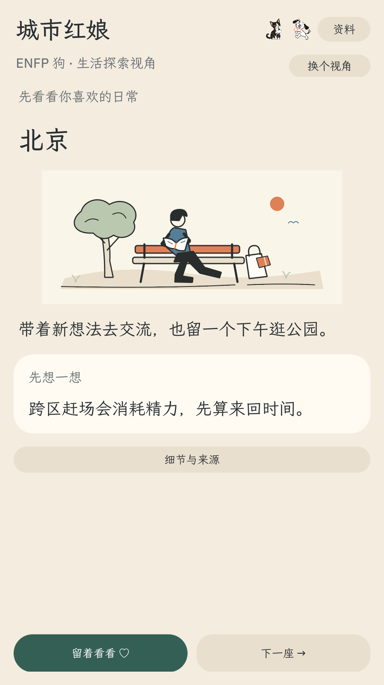
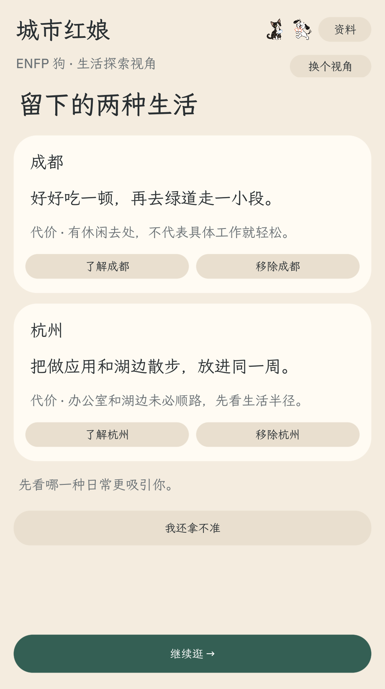
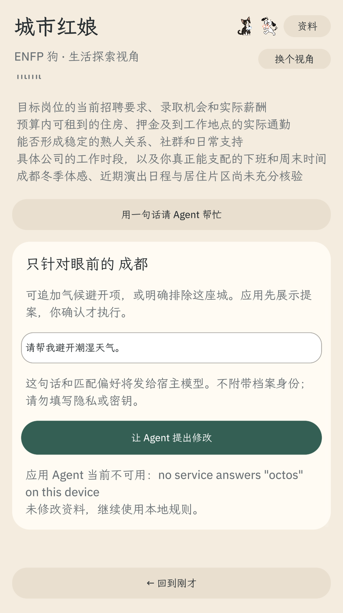
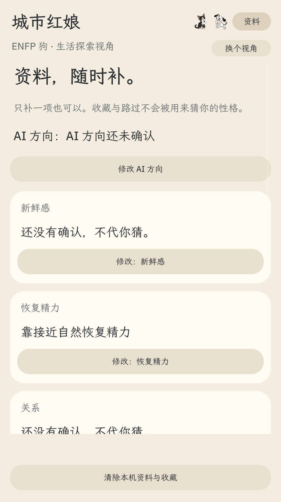

# Joy City v0.4 · 原生真实演示

本页对应当前 **v0.4.0** 原生流程：**打开看城市 → 留下第一座 → 继续浏览 → 留下第二座 → 两城比较 → 按需追问、看来源与资料**。历史 v0.3 五题演示仍保留，但不再代表当前产品。

[观看 v0.4 原生 MP4](demo-native-v0.4.mp4) · [v0.4 录制报告](../qa/native-demo-v0.4/recording-report.json) · [原生运行说明](octosense.md) · [产品设计](product-design.md)

## 这段视频是什么

视频来自当前 production `bundle/main.splash`，SHA-256 为 `8ad19df2a9375b68624aec5cd25c5c9b4ca5e68b88c5736008f708db5d1969ca`。录制脚本复制当前 bundle 到临时目录，由真实 `card-host` 启动；启动前的隔离存档为空。整段操作只通过真实指针点击、文本输入与滚动完成，没有注入源码、存档或 Agent 响应，也没有操作用户原有窗口。

成片长 **158.0 秒（2分38秒）**，分辨率 **920×1850**，H.264／25fps，共 3950 帧、2,745,673 字节。视频 SHA-256：

```text
b97999d8dc656131864f8bd0b1e13b0ffad3db7938e02e328e47875b3fb5067a
```

编码后已用 ffmpeg 从头到尾完整解码，返回零错误；另抽查 4、56、115、132、153 秒，确认原生画面、中文章节字幕、Agent 不可用提示和最终两城比较均可读。录制结束后 production `main.splash` 哈希未变，旧 v0.3 视频也未被覆盖。

## 本片能核对的行为

| 时间 | 真实操作与结果 |
| --- | --- |
| 0–17 秒 | 空白存档直接打开北京城市卡；“下一座”只继续浏览，没有拒绝城市或补写五维。 |
| 17–51 秒 | 留下成都，打开单城清单后点“继续逛”；路过广州，再留下杭州。第二次收藏直接进入成都／杭州比较。 |
| 51–83 秒 | 两城先展示吸引力与代价；点“我还拿不准”后，只补一项恢复精力偏好，收藏保持不变。 |
| 83–103 秒 | 打开成都详情和公开依据；来源、代价、岗位／住房／通勤等未知项同时出现。 |
| 103–125 秒 | 输入“请帮我避开潮湿天气。”并真实请求应用 Agent。`card-host` 明确返回服务不可用，请求前后存档字节一致。 |
| 125–158 秒 | 按需打开资料页；只有刚才明确回答的恢复精力一项被记录，其余四维继续显示未确认。最后回到两城比较。 |

本片中的北京、成都与杭州来自这次空白存档下 production bundle 的真实浏览顺序，没有固定城市或结果注入。城市顺序和人工整理线索不是推荐准确率、岗位概率或幸福概率。









## Agent 证据边界

`card-host` 本身没有模型服务，因此本片展示的是**真实失败处理证据**：应用清楚提示 Agent 不可用，继续使用本地规则，并保持存档不变。它不是模型成功演示，录制报告将 `realModelSuccessVerified` 记为 `false`。完整 OctoSense Shell 中另有一次 MiniMax-M3 返回、确认、执行、保存与恢复的独立验收，见[真实 Agent 全链路报告](../qa/real-agent-e2e-v0.4/README.md)；该证据不追溯写入本片。

## 历史 v0.3 演示

[v0.3 原生 MP4](demo-native.mp4) · [v0.3 录制报告](../qa/native-demo/recording-report.json) · [v0.3 分镜说明](demo-script.md)

旧片约 2分31秒，展示先答五个生活场景、核对画像、两轮推荐、切换视角与来源。它保留用于追溯历史提交材料，不能作为 v0.4“先看城市、留两座”流程的运行证据。辅助 [Web MP4](demo-web.mp4) 同样仍是 v0.3 研究界面，不代表当前原生主入口。

## 复现

在仓库根目录运行：

```sh
python3 tools/record-native-demo.py
```

脚本默认输出 `docs/demo-native-v0.4.mp4` 与 `qa/native-demo-v0.4/recording-report.json`，并保留旧 v0.3 文件。若工具不在默认位置，可通过 `OCTO_CARD_HOST`、`OCTO_HUB`、`FFMPEG`、`FFPROBE` 和 `DEMO_FONT` 指定。脚本会在临时目录复制、stamp、check 当前 bundle，再使用独立空白状态录制；不会修改 production 源码或数据。
