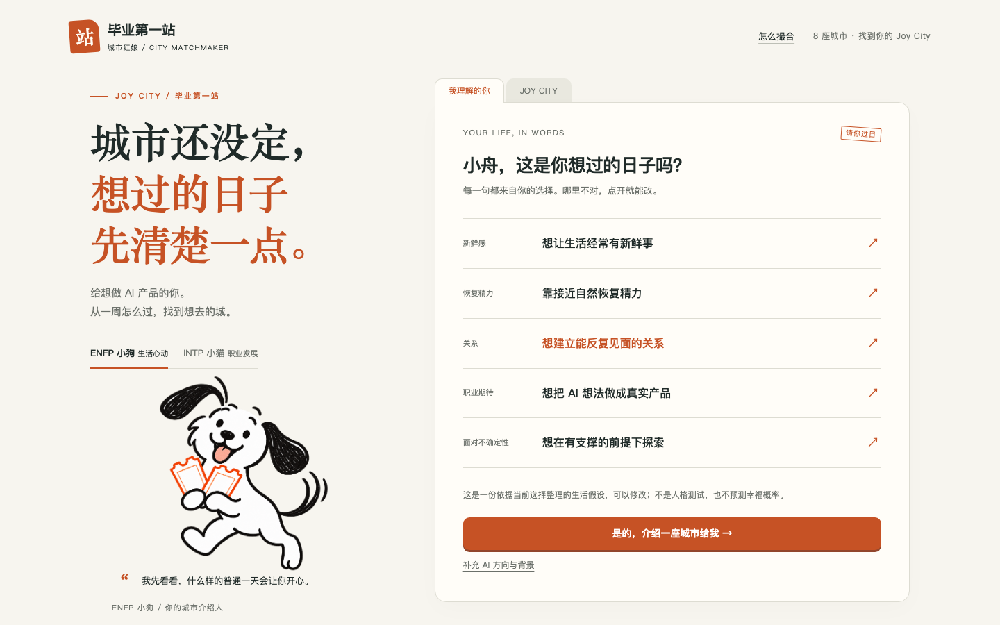
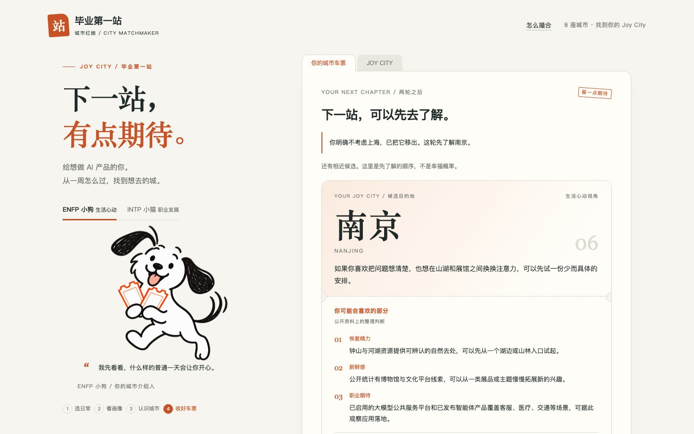

# Joy City v0.3 · 2分31秒实际操作演示

[观看或下载 MP4](demo-web.mp4) · [镜头说明](demo-script.md) · [初赛清单](submission-checklist.md)

本片为 v0.3 真实浏览器操作，使用“小舟／示例大学”等合成资料。演示五个生活场景、画像核对、首次城市介绍、明确拒绝、关键追问、第二轮结果、试城计划、来源、猫狗视角、PNG 下载与刷新恢复。

**范围：Web、本地规则；无真实模型调用。** 不代表原生 OctoSense 录屏或系统 Agent 成功证据。

## 可核对的结果

- 空画像明确提示不足，展示顺序不等于适合程度。
- 合成 AI 设计方向与生活答案先介绍上海。
- 明确拒绝上海后，第二轮候选为南京、深圳、北京，拒绝记录保留。
- 猫狗使用同一资料和底线、不同权重；切换不会替用户修改答案。
- 来源可追溯；缺少证据的偏好用于试城计划而非凭空加分。
- 实际生成并下载 PNG，不带昵称、院校、预算或重要的人位置。
- 刷新恢复当前结果，整个录制无远端资料请求。

成片 **151秒，1440×1000，25fps，H.264，3,935,397字节**。无声，中文说明字幕放在浏览器画面下方，未改写应用显示。

录制报告：[recording-report.json](../qa/demo-web/recording-report.json)。已完整 ffmpeg 解码及 Chromium 实际播放，录制记录中的10个源码／数据文件 SHA-256 均与最终文件一致：[播放与版本核验](../qa/demo-video-validation.json)。旧 v0.2 视频保留在 v0.2.0 Git 标签，当前路径已更新。





## 复现

先运行 `node serve.mjs`，另在具备 Playwright、Chromium、ffmpeg 和中文字体的环境运行：

```sh
DEMO_URL=http://127.0.0.1:4318 node qa/record-demo.mjs
node qa/validate-demo.mjs
```

可用 `PLAYWRIGHT_MODULE`、`FFMPEG`、`DEMO_FONT` 指定工具位置。这些仅用于制作材料，不是产品运行依赖。脚本使用隔离浏览器，覆盖自己的 `qa/demo-web/` 输出和视频；原始录制及中间字幕留在系统临时目录。

本地产品服务器不提供 docs 文件；观看请直接打开 MP4 或 GitHub 链接。GitHub Markdown 未必内嵌播放器，可下载观看。
