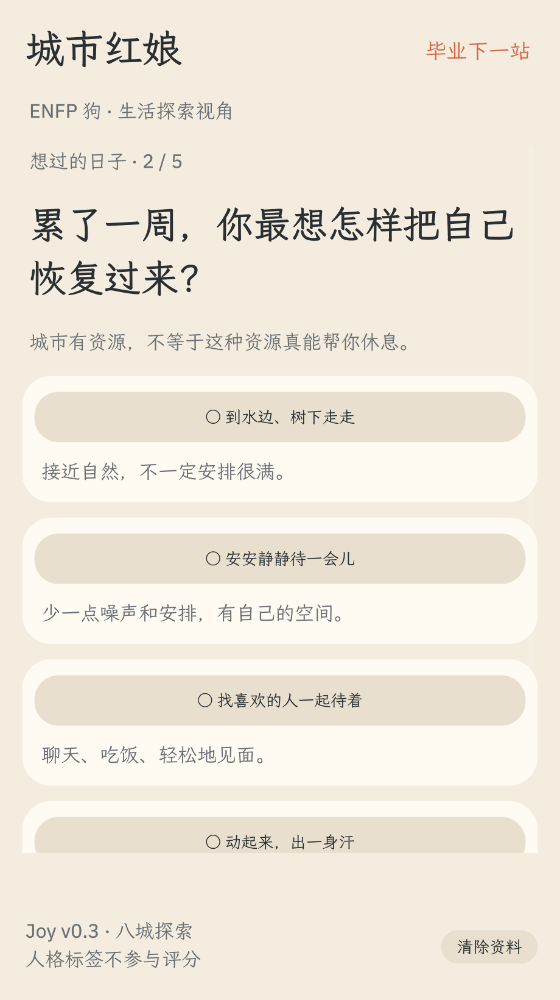
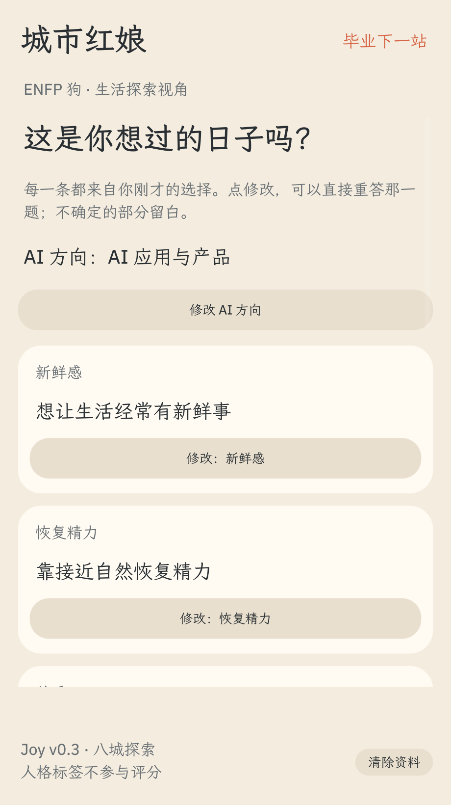
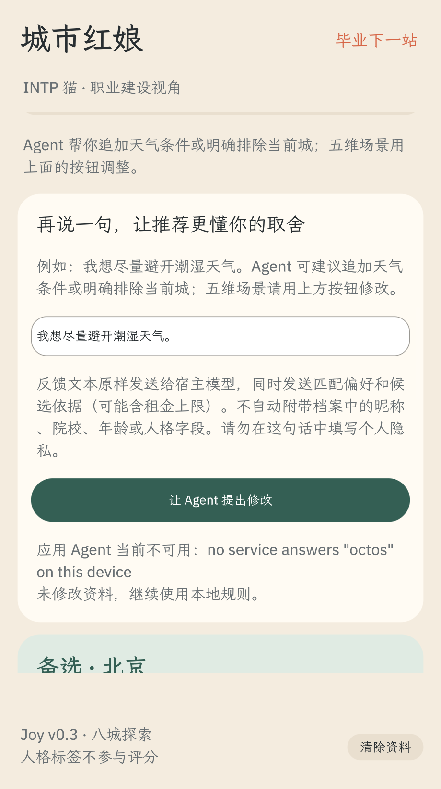

# Joy City v0.3 · 历史原生演示

**版本提示（2026-10-05）：本页影片与截图记录 v0.3 问卷流程，不能代表 v0.4“看城市、留两座”的新交互。** 新版请按 [原生运行说明](octosense.md)体验，并核对 [产品设计](product-design.md)与本次原生截图。旧影片保留用于追溯初赛已提交材料；其哈希只与下述固定提交一致。

[观看原生 MP4](demo-native.mp4) · [原生录制报告](../qa/native-demo/recording-report.json) · [初赛清单](submission-checklist.md)

**主交付是 `bundle/main.splash` 的 OctoScript 应用。** 本片使用 v0.3 生产源码，在独立隐藏 card-host 窗口中实际操作并连续采帧，使用合成资料；没有源码注入、状态注入，也没有操作用户已有窗口。录像报告中的程序 SHA-256 对应 v0.3，不是当前 v0.4。

原生影片约 **2分31秒，920×1840，H.264／25fps编码，4,147,584字节**。原生画面为920×1640，底部添加说明字幕；窗口约每秒采集5帧，未用静态概念图替代交互。录制断言、完整视频解码与 [Chromium 实际播放](../qa/native-demo/playback-validation.json)均通过；[成片画面检查](../qa/native-demo/visual-check.json)核对22／83／136秒，确认场景、首城及不可用提示可读，字幕没有遮挡应用。

本片与对应原生源码已公开于固定提交 [`f4566a5`](https://github.com/SuperLeilei2026/city-matchmaker/tree/f4566a5f0bb254829e8ed193541ebd0a539e10ec)；公开仓库已核对包含该提交。当前版本与后续文档说明见 [发布状态](publication.md)。

## 本片能核对的行为

1. 从空白存档选择 AI 方向，逐页回答五个生活场景，再填写合成预算4000、独居与45分钟通勤条件。
2. 先核对画像，单独修改一个场景后返回画像，其余答案保留；确认后首次介绍成都。
3. 反馈并确认恢复方式为安静，第二轮重新介绍上海；这是本次合成资料的结果，应用不保证改一个答案必定换城。
4. 切换猫狗观察角度，保留原答案与底线；显示三条试城计划，并打开真实来源界面。
5. 实际请求应用 Agent，card-host 返回服务不可用；应用提示限制，存档保持不变。

最后一步是**真实失败处理证据，不是真实模型成功证据**。本应用在完整 Shell 中的模型返回、用户确认、执行与恢复仍待验收。另有原生12项界面、4项存档／迁移、7组对照，以及5项Agent生产路径和21项临时响应检查；后者的模拟响应没有进入这部影片。

## 辅助 Web 录像

[Web MP4](demo-web.mp4)仅辅助说明交互与规则。该片151秒、1440×1000、H.264，展示合成用户首轮上海、明确拒绝后南京／深圳／北京，以及PNG下载和刷新恢复；这些不是原生影片的操作结果。原生当前没有PNG导出。

Web 的[录制报告](../qa/demo-web/recording-report.json)和[播放核验](../qa/demo-video-validation.json)记录完整解码、Chromium播放和源码哈希。旧v0.2视频保留于旧Git标签，当前路径对应v0.3。

## 复现

原生运行与工具版本见 [octosense.md](octosense.md)、[runtime-lock.md](runtime-lock.md)。原生录制脚本为 `tools/record-native-demo.py`，使用独立临时状态目录，不读取用户存档；精确参数、阶段时间点及录像校验见原生报告。

辅助 Web 可先执行 `node serve.mjs`，再在具备Playwright、Chromium、ffmpeg和中文字体的环境运行 `qa/record-demo.mjs`、`qa/validate-demo.mjs`。录制依赖不是原生应用运行依赖。本地Web服务器不提供docs文件；观看请直接打开MP4，发布后也可从仓库下载。
