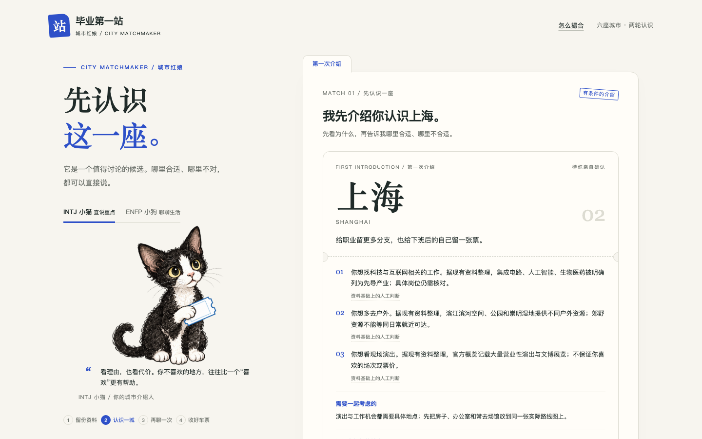

# 2分31秒：毕业第一站 Web 实际操作演示

[观看或下载 MP4](demo-web.mp4) · [逐镜头脚本](demo-script.md) · [初赛材料清单](submission-checklist.md)

本片录制本地运行的真实应用，不是界面概念稿。使用“小舟 / 示例大学”等合成资料，展示空资料提示、三页资料、首次推荐、明确拒绝、第二轮重排、资料来源、猫狗切换、PNG 下载与刷新恢复。

**范围：Web 体验版、确定性本地匹配。** 片中没有真实模型调用，也不代表 OctoSense 原生版或系统 Agent 已验证。原生 Agent 升级后的实际演示另行补录，不能用本片替代。

## 片中如何核对结果

- 空资料跳过首问：显示资料不足与城市分不出先后。
- 合成资料选择科技、户外、演出，首问优先工作：先介绍上海。
- 明确不考虑上海，第二问重点选择户外：上海移出候选，杭州、武汉、成都进入当前前三；结果解释排除与调整。
- 打开来源弹窗：显示来源、人工分档和仍需核实的内容。
- 换成小狗：表达改变，候选次序保持一致。
- 下载城市车票：真实生成 PNG；默认不带昵称、学校、年龄、预算或欣赏对象信息。
- 刷新：恢复同一轮结果。测试浏览器独立于日常浏览器。

视频含中文说明字幕，无声；字幕位于应用画面下方，浏览器中的产品显示与实际操作未被替换。实际成片151.000秒，1440×1000、25fps、H.264 MP4，3,713,635字节（约3.54MiB）。录制脚本已通过状态、页面错误、候选变化和网络请求检查；实际报告位于 `qa/demo-web/recording-report.json`，passed 为 true，无页面异常或远端资料请求。

成片另经完整 ffmpeg 解码和 Chromium 实际播放检查，并人工查看12、94、130、148秒画面，确认字幕可读、空状态/改推/分享与结尾准确。核验记录为 `qa/demo-video-validation.json`。产品服务刻意只提供应用资源，不提供 `docs/`；本地观看请直接打开 MP4，不能把产品地址后拼接文档路径当作视频服务。

## 两张关键截图

两图来自同次真实录屏过程，使用合成资料：




## 复现录制

先启动产品：

```sh
node serve.mjs
```

另开终端，在已准备好 Playwright、Chromium 与 ffmpeg 的环境中运行：

```sh
node qa/record-demo.mjs
```

可以通过 `PLAYWRIGHT_MODULE` 指定 Playwright 模块的绝对路径，通过 `FFMPEG` 指定 ffmpeg，通过 `DEMO_FONT` 指定支持中文的字体，通过 `DEMO_URL` 指定本机地址。默认字幕字体为 macOS 的 Arial Unicode；这些工具仅用于录屏，不是产品试玩的依赖。脚本会覆盖它自己的 `qa/demo-web/` 输出和 `docs/demo-web.mp4`；原始 WebM、中间字幕和转码脚本保留在系统临时目录，不进入仓库。

该脚本记录来源文件的 SHA-256、基线提交号和实际操作时间。本片随 v0.2.0 材料提交；该版本的 Web 源码与录制时一致，`qa/demo-video-validation.json` 保留复核结果。v0.1.0 标签不包含本片。原生 Agent 的实际状态见 [公开版本说明](publication.md)，不能把 Web 录像与原生模型证据混用。

GitHub Markdown 不保证将仓库内 MP4 内嵌为播放器；直接点开或下载文件可观看。本片不依赖录屏工具运行时，也没有虚构远端 Demo 链接。
